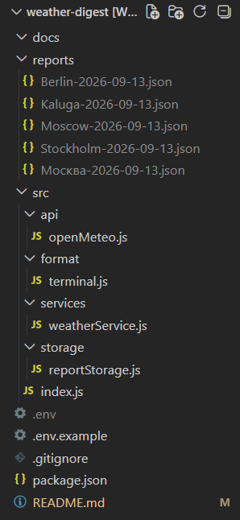

# Погодный дайджест

Консольное приложение на Node.js для получения прогноза погоды по одному или нескольким городам. Приложение использует API сервиса Open-Meteo, получает координаты города, запрашивает прогноз погоды и сохраняет полученный отчёт в формате JSON.

## Возможности

Программа позволяет:
* указать один или несколько городов через командную строку;
* получить координаты города через Open-Meteo Geocoding API;
* получить прогноз погоды через Open-Meteo Forecast API;
* указать количество дней прогноза;
* сохранить полученный отчёт в формате JSON;
* использовать ранее сохранённый отчёт, если в нём уже есть необходимое количество дней прогноза;
* обработать ошибки неправильных аргументов, отсутствия города и ошибок API.

## Требования

* Node.js 20+
* npm

## Установка

Клонировать репозиторий:

```bash
git clone <ссылка-на-репозиторий>
```

Перейти в папку проекта:

```bash
cd weather-digest
```

Установить зависимости:

```bash
npm install
```

## Переменные окружения

В корне проекта необходимо создать файл `.env`.
Пример:

```env
GEOCODING_BASE_URL=https://geocoding-api.open-meteo.com/v1/search
WEATHER_BASE_URL=https://api.open-meteo.com/v1/forecast

TEMPERATURE_UNIT=celsius
PRECIPITATION_UNIT=mm

REQUEST_TIMEOUT_MS=5000
```

## Запуск

Пример запуска для одного города:

```bash
npm start -- --city Berlin --days 2 --no-cache
```

Для нескольких городов:

```bash
npm start -- --city Berlin,Kaluga,Moscow --days 5
```

## Результат работы

После выполнения программы отчёт сохраняется в папке `reports` в формате JSON.

Например:

```text
reports/
└── Moscow-2026-09-13.json
```

Пример содержимого файла:

```json
{
  "city": "Москва",
  "latitude": 55.75204,
  "longitude": 37.61781,
  "forecast": [
    {
      "date": "2026-09-13",
      "temperatureMax": 16.5,
      "temperatureMin": 7.7
    },
    {
      "date": "2026-09-14",
      "temperatureMax": 18.6,
      "temperatureMin": 9.3
    },
    {
      "date": "2026-09-15",
      "temperatureMax": 18.1,
      "temperatureMin": 11
    }
  ]
}
```

## Кэширование

Перед выполнением запроса прогноза программа проверяет наличие ранее сохранённого отчёта. Если файл существует и содержит необходимое количество дней прогноза, используется сохранённый результат. Если файла нет или данных недостаточно, программа выполняет новый запрос к API и сохраняет полученный результат в JSON-файл.

## Обработка ошибок

Программа обрабатывает следующие ситуации:

* отсутствуют необходимые аргументы командной строки;
* указано некорректное количество дней;
* город не найден;
* произошла ошибка при обращении к API;
* запрос превысил установленный таймаут;
* произошла ошибка чтения или записи файла.

В случае ошибки программа выводит понятное сообщение в консоль и завершает выполнение с соответствующим кодом.

## Структура проекта




## Технологии

* Node.js
* JavaScript
* Open-Meteo API
* Fetch API
* async/await
* JSON
* dotenv
